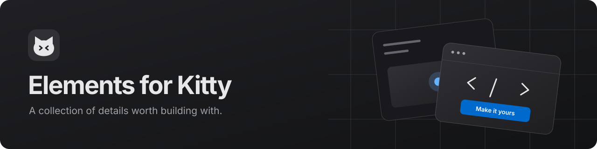
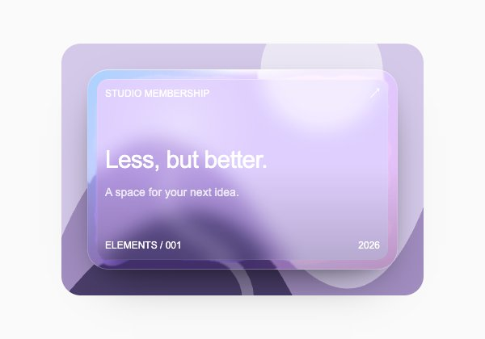
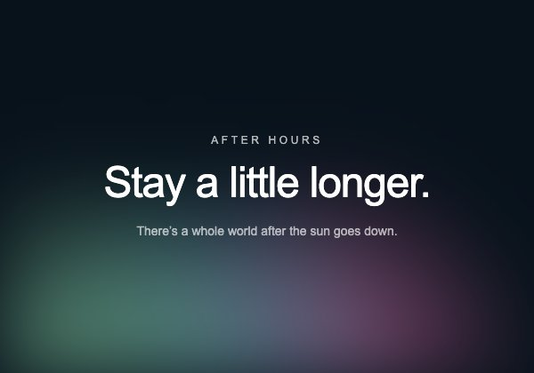
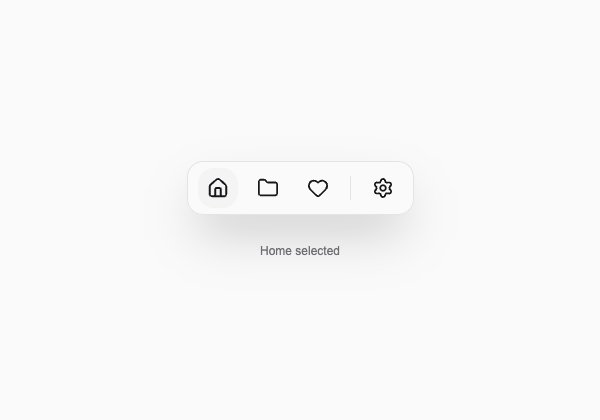

<p align="center">
  
</p>

<p align="center">
  <a href="https://github.com/NikroZorkin/ElementsUIforKitty/actions/workflows/ci.yml"></a>
  <a href="LICENSE"></a>
  <a href="#the-collection"></a>
  <a href="#credits-and-license"></a>
  <a href="https://github.com/NikroZorkin/ElementsUIforKitty/stargazers"></a>
</p>

<h3 align="center">A playground for React components.</h3>

<p align="center">
  130 live examples · 8 categories · Light and dark themes<br />
  Browse the interaction. Read the source. Bring the code into your project.
</p>

<p align="center">
  <a href="https://elements-for-kitty.vercel.app"><strong>Live demo</strong></a> ·
  <a href="#selected-previews"><strong>Previews</strong></a> ·
  <a href="#the-collection"><strong>Components</strong></a> ·
  <a href="#use-a-component"><strong>Copy for AI</strong></a> ·
  <a href="#credits-and-license"><strong>Credits</strong></a>
</p>

<p align="center">
  <a href="package.json"></a>
  <a href="package.json"></a>
  <a href="tsconfig.json"></a>
  <a href="package.json"></a>
</p>

---

## What is Elements for Kitty?

Elements for Kitty is a curated collection of React components from **Kokonut UI, SmoothUI, beUI, and Magic UI**. It brings their examples, source files, setup instructions, and licenses into one searchable catalog with a macOS-inspired interface.

Every live preview runs the same source files you can copy. Take a single file, or use **Copy for AI** to bring a complete working example into your coding assistant. No account, database, or API key is required to use the catalog.

## Quick start

**[Open Elements for Kitty →](https://elements-for-kitty.vercel.app)**

1. Browse the collection, search for a component, or choose a category.
2. Open an example to try its interaction and explore the source.
3. Use **Copy code** for one file or **Copy for AI** for the complete example and setup instructions.

No account or installation is required to explore the catalog. See [Getting started](https://elements-for-kitty.vercel.app/getting-started) for component setup, or [Development](#development) to run and contribute to the catalog itself.

## Selected previews

A few components from the collection. Select an illustration to try the live example and explore its source.

<table>
  <tr>
    <td align="center" width="33%">
      <a href="https://elements-for-kitty.vercel.app/components/glass-card">
        <picture>
          <source media="(prefers-color-scheme: dark)" srcset="public/thumbnails/glass-card-dark.jpg" />
          
        </picture>
      </a><br />
      <strong>Glass Card</strong><br /><sub>Cards · SmoothUI</sub>
    </td>
    <td align="center" width="33%">
      <a href="https://elements-for-kitty.vercel.app/components/aurora-curtain">
        <picture>
          <source media="(prefers-color-scheme: dark)" srcset="public/thumbnails/aurora-curtain-dark.jpg" />
          
        </picture>
      </a><br />
      <strong>Aurora Curtain</strong><br /><sub>Backgrounds · SmoothUI</sub>
    </td>
    <td align="center" width="33%">
      <a href="https://elements-for-kitty.vercel.app/components/dock">
        <picture>
          <source media="(prefers-color-scheme: dark)" srcset="public/thumbnails/dock-dark.jpg" />
          
        </picture>
      </a><br />
      <strong>Dock</strong><br /><sub>Navigation · beUI</sub>
    </td>
  </tr>
</table>

## Features

|                               | What you can do                                                                                                                                     |
| ----------------------------- | --------------------------------------------------------------------------------------------------------------------------------------------------- |
| **Find a starting point**     | Search, browse eight categories, filter by library, or explore the Featured selection. Switch between grid and list views.                          |
| **Try the real thing**        | Hover over a card for a live preview; on touch screens, use its play button. Open the component to click, interact, resize, or restart the example. |
| **Bring the code with you**   | Read highlighted source files and copy one file or a complete example, including dependencies, styles, assets, and licenses.                        |
| **Work with your AI editor**  | **Copy for AI** prepares the example and setup instructions for the assistant you already use. The catalog makes no AI API calls.                   |
| **Keep your favorites**       | Bookmark components and return to them in Saved. Favorites and appearance preferences stay in your browser, with no account required.               |
| **Make yourself comfortable** | Light, dark, and system themes; a separate preview theme; keyboard navigation; and reduced-motion support in the catalog shell.                     |

The catalog has a macOS-inspired shell with translucent navigation and controls. Each component keeps its original visual style. Search and filters are reflected in the URL; saved items are local to each browser and do not sync between devices.

## Use a component

1. **Find it.** [Browse the catalog](https://elements-for-kitty.vercel.app) or focus search with **⌘ K / Ctrl K**. Open a component to explore its live preview.
2. **Try it.** Change the preview width or theme, interact with the example, and check **How to use** for its setup.
3. **Copy it.** Choose **Copy code** for the selected file, or **Copy for AI** for the complete example. When copying files manually, include the helpers and assets listed in the source viewer.
4. **Make it yours.** Install the listed dependencies, preserve the supplied relative paths, and keep the included copyright and license notices.

The examples target **React 19, TypeScript, and Tailwind CSS 4**. Each component lists its own dependencies. Exported examples work in a React project without requiring Next.js.

When using **Copy for AI**, paste the clipboard contents into your coding assistant and add a concrete request, for example:

> Add this card to my existing gallery. Use the project's colors and spacing, preserve its keyboard behavior, and keep the included license notices.

## The collection

| Category                                                                          | Components | A few starting points                            |
| --------------------------------------------------------------------------------- | ---------: | ------------------------------------------------ |
| [Buttons & Controls](https://elements-for-kitty.vercel.app/category/buttons)      |         18 | Particle Button, Hold Button, Shimmer Button     |
| [Cards](https://elements-for-kitty.vercel.app/category/cards)                     |         17 | Glass Card, Card Flip, Apple Activity Card       |
| [Text & Typography](https://elements-for-kitty.vercel.app/category/text)          |         16 | Sliced Text, Spinning Text, Scramble Hover       |
| [Backgrounds](https://elements-for-kitty.vercel.app/category/backgrounds)         |         17 | Aurora Curtain, Liquid Metal, Pixel Flow Field   |
| [Navigation](https://elements-for-kitty.vercel.app/category/navigation)           |         15 | Dock, Bloom Menu, Animated Tabs                  |
| [Galleries & Carousels](https://elements-for-kitty.vercel.app/category/galleries) |         16 | Coverflow Carousel, Photo Stack, Infinite Slider |
| [Sections](https://elements-for-kitty.vercel.app/category/sections)               |         15 | Shape Hero, Spotlight Hero, Feature Highlights   |
| [Feedback & Loaders](https://elements-for-kitty.vercel.app/category/feedback)     |         16 | Circular Progress, AI Loader, Skeleton Loader    |

Component metadata and original source links live in [data/entries.json](data/entries.json).

## Development

The app uses Next.js 16, React 19, TypeScript strict, Tailwind CSS 4, Motion, Phosphor, Shiki, Radix Dialog, and Playwright. Exact dependency versions are recorded in [package-lock.json](package-lock.json).

Requires **Node.js 22 or newer** and npm.

```sh
git clone https://github.com/NikroZorkin/ElementsUIforKitty.git
cd ElementsUIforKitty
npm ci
npm run dev
```

Open the address printed by Next.js in your terminal. The catalog needs no environment variables, database, API keys, or sign-in. Component sources, sample artwork, thumbnails, and the demo font are included in the repository. Both development and production builds generate the source bundles automatically.

For a production build:

```sh
npm run build
npm run start
```

The public catalog is hosted on [Vercel](https://elements-for-kitty.vercel.app). Changes pushed to `main` are automatically deployed to production.

To deploy your own copy, import the repository into Vercel, choose the **Next.js** preset, use `npm ci` to install dependencies, and set the build command to `npm run build` so source bundles are generated before compilation.

<details>
<summary><strong>Project structure</strong></summary>

| Path                           | Responsibility                                                                     |
| ------------------------------ | ---------------------------------------------------------------------------------- |
| `app/(site)`                   | Catalog, categories, saved items, component details, getting started, and sources. |
| `app/(preview)/preview/[slug]` | Isolated, interactive component previews.                                          |
| `components`                   | Catalog shell, filters, cards, and source viewer.                                  |
| `data/entries.json`            | Component descriptions, categories, upstream URLs, and pinned commits.             |
| `data/catalog.ts`              | Categories, libraries, tags, and the Featured selection.                           |
| `data/provenance.json`         | Mapping between local files and their upstream sources.                            |
| `registry`                     | Canonical component source shared by previews and exports.                         |
| `registry/demos`               | Working usage examples for each component.                                         |
| `registry/demo.css`            | Portable styles for examples, separate from the catalog shell.                     |
| `scripts/buildCatalog.mjs`     | Import traversal, dependency checks, and source bundle generation.                 |
| `data/generated`               | Generated source bundles and the preview import registry.                          |
| `public/thumbnails`            | Screenshots of the demos in both themes.                                           |
| `licenses`                     | License texts included with exported examples.                                     |

</details>

### Checks

```sh
npm run check          # TypeScript and ESLint
npm run format:check   # Prettier
npm run test:exports   # Build and type-check each exported example
npm run build         # Production build
npm audit --omit=dev   # Production dependency advisories
```

For browser checks, keep `npm run start` running in another terminal, then run:

```sh
npm run test:e2e
```

The browser suite covers the catalog, source bundles, clipboard actions, saved items, themes, keyboard interactions, all component previews, and viewport widths of **390, 768, 1024, and 1280 px**. Axe checks the catalog shell, source viewer, and mobile navigation.

On macOS the scripts use Google Chrome when installed. Otherwise, run `npx playwright install chromium`. Override the browser with `PLAYWRIGHT_CHROMIUM_EXECUTABLE_PATH` or the site URL with `PREVIEW_URL`. Reports are written to `playwright-report/`; screenshots are written to `artifacts/`.

### Add or update a component

1. Check the license of the exact free source file and pin its upstream commit.
2. Place source files in `registry/<source>` with relative imports and the license in `licenses`.
3. Add a working example in `registry/demos/<slug>.tsx`.
4. Update `data/entries.json` and `data/provenance.json`; adjust `data/catalog.ts` if needed.
5. Run `npm run catalog` to refresh the source bundles and preview registry. Repeat after editing sources during a dev session.
6. With the site running, run `npm run thumbnails -- <slug>`, then the checks above.

`npm run thumbnails` without a slug refreshes all 260 thumbnails. When adding entries, also update the counts in this README and [THIRD_PARTY_NOTICES.md](THIRD_PARTY_NOTICES.md).

## Security

See [SECURITY.md](SECURITY.md) for the application's security boundaries, checks, and private reporting channel. The browser suite also checks storage failures, malformed preferences, security headers, private-file exposure, and search input escaping. Run `npm audit` to include development dependencies in the advisory check.

## Credits and license

Elements for Kitty brings together selected components from these independent projects. Each component links back to its original source and includes the required license notices.

| Library                                                 | Included components | License                      |
| ------------------------------------------------------- | ------------------: | ---------------------------- |
| [Kokonut UI](https://github.com/kokonut-labs/kokonutui) |                  29 | [MIT](licenses/kokonut.txt)  |
| [SmoothUI](https://github.com/educlopez/smoothui)       |                  77 | [MIT](licenses/smoothui.txt) |
| [beUI](https://github.com/starc007/ui-components)       |                   8 | [MIT](licenses/beui.txt)     |
| [Magic UI](https://github.com/magicuidesign/magicui)    |                  16 | [MIT](licenses/magicui.txt)  |

The catalog shell, local examples, adapters, and original SVG artwork are [MIT licensed](LICENSE). Components retain their upstream licenses; Pacifico, used by Shape Hero, includes its [SIL Open Font License](licenses/pacifico.txt).

The shell takes visual cues from the [macOS community Figma kit](https://www.figma.com/design/TIVUCt5mozX2jlnWcfLR07/macOS-27--Community-?node-id=207-14490). It uses the system font; Apple fonts and Figma preview images are not redistributed. The README banner is original vector artwork; component illustrations are screenshots of the local demos.

See [THIRD_PARTY_NOTICES.md](THIRD_PARTY_NOTICES.md) for pinned upstream versions, local adaptations, and presentation references.
